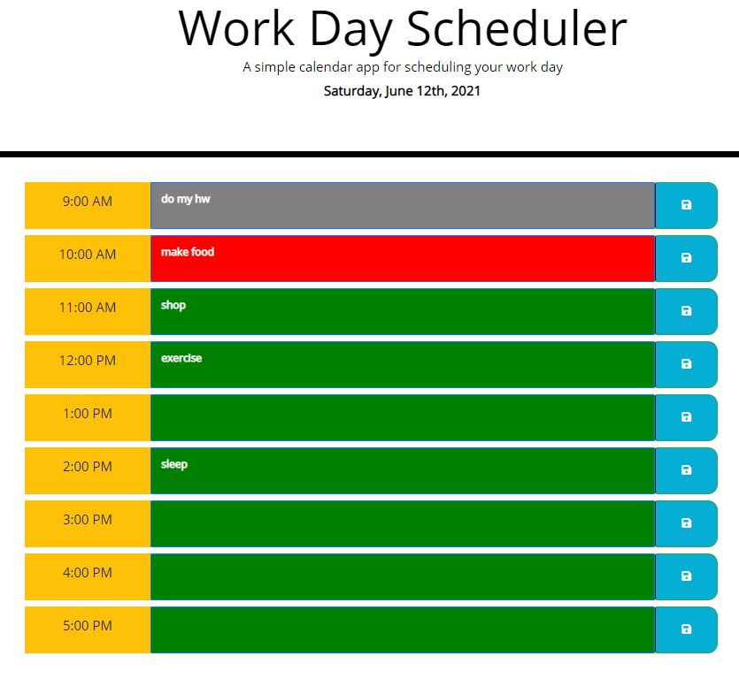
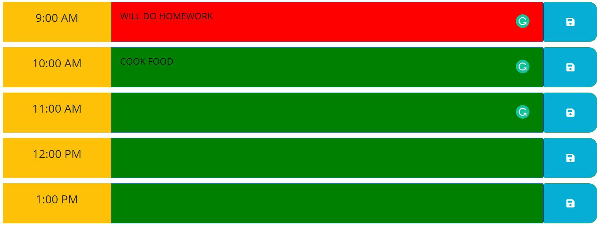
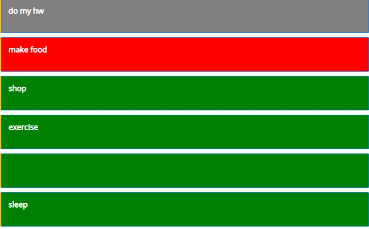

# Work Day Scheduler

<h4>Designed and coded by <a href="https://github.com/fizzaaz">FIZZA ZAIDI</a></h4>
This project was designed as a homework assignment for UT Austin coding bootcamp. This application emphasizes the use of jQuery to dynamically update the HTML and CSS code to generate the Work Day Scheduler.

## Getting Started
This project has been deployed to GitHub Pages. To get this project up and running, you can follow the deployment link. Or, download the sources files to use this as a template.

* [GitHub Repository](https://github.com/fizzaaz/Work-Day-Scheduler)
* [Deployed GitHub IO](https://fizzaaz.github.io/Work-Day-Scheduler/)

### Prerequisites

To install this application, you will need a text editor. I would recommend Visual Studio Code. 

### Installing

To install this code, download the zip file, or use GitHub's guidelines to clone the repository. 

### Summary
This application emphasizes the use of Jquery to provide a simple planner application that allows the user to save events for each hour of the day. This app will run in the browser and feature dynamically updated HTML and CSS powered by jQuery. In this application, we have used the Moment.js library to work with date and time. This planner app, loops through the typical business hours at current date and allows the user to enter and save their plan into any description field that has a class of future. Also, the localStorage of the browser is used to store the data. The past hours are highlighted gray, the current hour red, and future hours green.

### Features: 
* Current Date
    * This displays the current day at the top of the calendar.

* Time Block
    * This displays the typical business hours (9am to 5pm) in a horizontal layout.
    

* Text Area: 
    * It allows the user to enter their descriptive plan with respect specific business hour displayed in time block.

* Save Button
    * This allows the user to save their plan at a specific business hour in a local storage.

* Local Storage 
    * It is used to store the user's plan at specific time. The set and get methods are used to store and fetch the data from local storage respectively.
    
* Color-coded
    * The three colors are used to indicate the past, present and future event. Grey color indicates that time is past, red indicates that the time is present and green shows that time is future.

### Project Requirements
  * WHEN the user opens the planner THEN the current day is displayed at the top of the calendar
  * WHEN the user scroll down THEN I am presented with time blocks for standard business hours
  * WHEN the user view the time blocks for that day THEN each time block is color-coded to indicate whether it is in the past, present, or future.
  * WHEN the user clicks into a time block THEN I can enter an event
  * WHEN the user clicks the save button for that time block THEN the text for that event is saved in local storage
  * WHEN the user refreshes the page THEN the saved events persist
 
### This project has script features of:
* Tells browser to load 1)html & 2)css first.
* Display current day.
* An event listener (onclick) that generates time interval
* Taken the change from the sibling html description attribute
* Taken the change from the parent html id attribute
* Set items in local storage.
* Get items from the local storage.
* Get current number of hours.
* Should follow html 24 hour to 12 hour conversion.
* use of moment.js
* loop over time blocks
* check if we've moved past this time, or we're in present, or future
* 
### File Types: 
* HTML
    * Index.html 
        * Contains the links to moment.js and bootstrap libraries.
        * Contains the basic information display on a browser and the basic structure of a application that is featured by jQuery.
* CSS Page
    * Styles.css
        * contains styling properties for html elements
* Javascript Page
    * script.js 
        * Variables
        * Event listeners
        * if/else if statements
        * For Loops
        * Functions 
        * Local Storage set and get function
 
